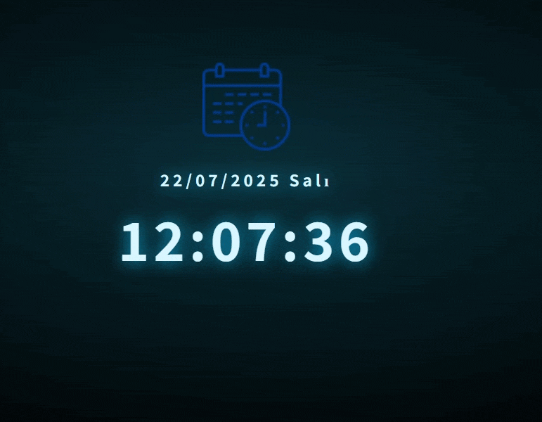

# 📆 Gerçek Zamanlı Tarih ve Saat Gösterimi
Bu proje, kullanıcıya şık bir arayüz ile güncel tarih ve saat bilgilerini gerçek zamanlı olarak sunar. HTML, CSS ve JavaScript kullanılarak geliştirilmiştir. Saat saniye saniye otomatik güncellenirken, tarih bilgisi sayfa yüklendiğinde belirlenir.

# Özellikler

📅 Gün / Ay / Yıl formatında tarih gösterimi

🕰️ Canlı saat (her saniye otomatik güncellenir)

🗓️ Türkçe gün isimleri (Pazartesi, Salı, vb.)

🌌 Karanlık tema ve parlak yazı stili ile şık tasarım

📱 Mobil uyumlu (Responsive)

# Kullanılan Teknolojiler

HTML5: Sayfa yapısı

CSS3: Arayüz tasarımı ve stil düzenlemeleri

Vanilla JavaScript: Zaman ve tarih işlemleri

#Ekran görünümü

